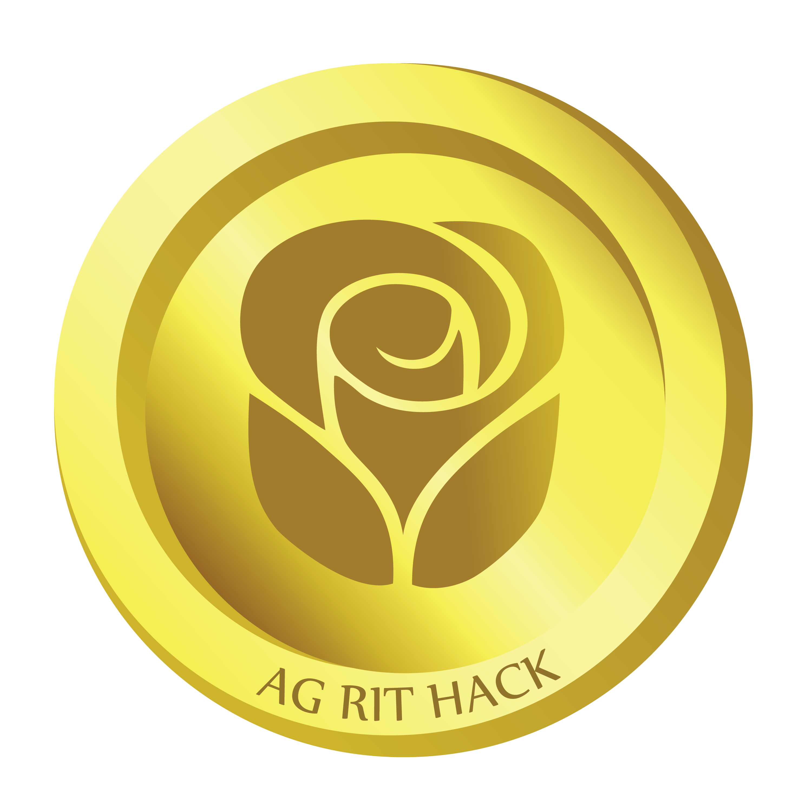

AGRITHack
=========

This repository is for work developed during the American Greetings RIT
Hackathon--a 24 hour competition for hackers AND designers. 

More information can be found at http://hack.ag.com

 This work is licensed under a <a rel="license" href="http://creativecommons.org/licenses/by-nc-sa/3.0/">Creative Commons Attribution-NonCommercial-ShareAlike 3.0 Unported License</a>.
